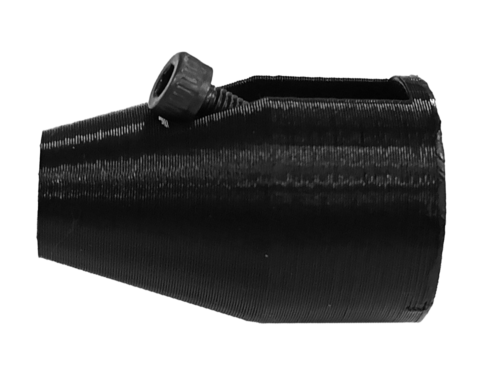
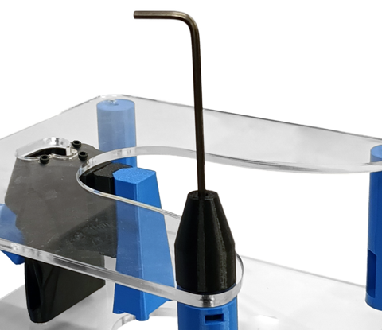

# Attach parts to the bottom plate

{{BOM}}

[M3x10mm cap head screw]: parts/mech/m3x10_screw.md "{cat:mechanic}"
[M3x15mm cap head screw]: parts/mech/m3x15_screw.md "{cat:mechanic}"
[M3 nut]: parts/mech/m3_nut.md "{cat:mechanic}"
[Bottom plate]: parts/materials/bottom-plate.md "{cat:lasercutpart}"
[2.5mm Ball-end Allen key]: parts/tools/2.5mmBallEndAllenKey.md "{cat:tool}"
[Focusing assembly]: models/focusing-assembly.stl "{previewpage}"
[Standoff]: models/standoff.stl "{previewpage}"
[Foot]: models/foot.stl "{previewpage}"

You will also need the parts you assembled in previous sections.

## Screw into the focusing assembly {pagestep}

* Attach the [bottom plate][Bottom plate](fromstep){qty:1} to the [focusing assembly][Focusing assembly] using 3 [M3x10mm cap head screws][M3x10mm cap head screw]{qty: 3}.
* Use a [2.5mm ball-ended hex key][2.5mm Ball-end Allen key]{qty:1} to turn the screws.

## Attach feet {pagestep}

* Take an [M3 nut]{qty:4} and push it into the nut trap from the [standoff][Standoff]. Insert one into each of standoff.
* Using four [M3x15mm cap head screws][M3x15mm cap head screw]{qty:4} and a [2.5mm ball-ended hex key][2.5mm Ball-end Allen key]{qty:1}, attach the [feet][Foot](fromstep){qty:4, cat:printedpart} by inserting the screw into the foot, then screwing into the [standoff][Standoff] through the hole in the [bottom plate][Bottom plate].

At this point, the main structure is complete.