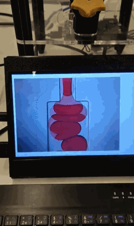

# Strobe-Enhanced Microscope Station

The strobe-enhanced microscopy stage is a free and open-source workstation for imaging fast processes, particularly developed for microfluidic droplet generation. It uses the lens from the Raspberry Pi Camera to produce a microscope with a field of view of almost 1mm and a strobe illumination based on a high-power LED for imaging fast-moving objects. Custom electronics allow the synchronization between the LED and the camera to capture sharp images of fast-moving droplets and other objects.

Find about more about this platform and other open-source hardware for bioimaging on the [LIBRE hub website](https://librehub.github.io/).

>i **Note:** This project and documentation are based on the [OpenFlexure Microscope](https://build.openflexure.org/openflexure-microscope/v7.0.0-beta1/low_cost_microscope) and [OpenFlexure Flat-top Microscope](https://rwb27.gitlab.io/openflexure-flat-top-microscope/1_preparing_laser_cut_parts).