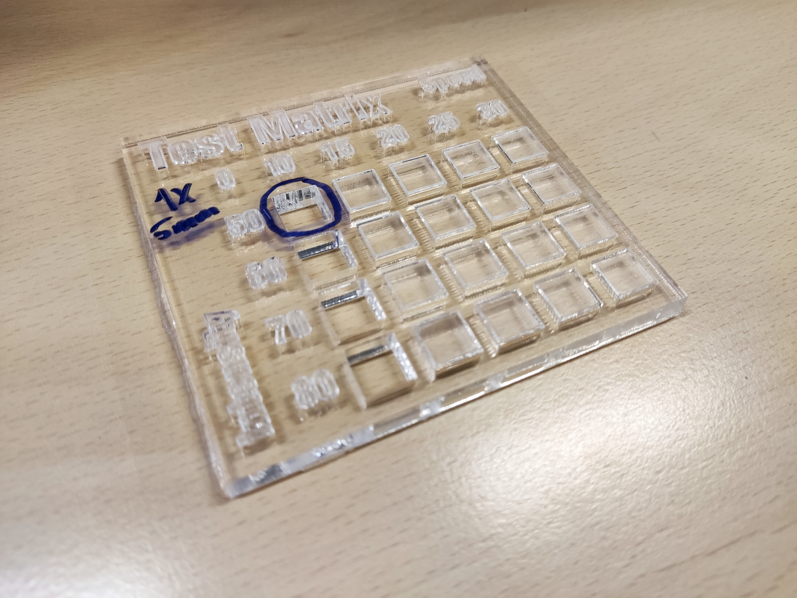

# Laser cut the acrylic parts

{{BOM}}

[52x18x0.5cm Acrylic sheet]: parts/materials/acrylic-sheet.md "{cat:material}"
[Laser cutting machine]: parts/tools/laser-cutting-machine.md "{cat:tool}"
[Tap wrench]: parts/tools/tap-wrench.md "{cat:tool}"
[M3 tap]: parts/tools/m3-tap.md "{cat:tool}"
[Lubricant]: parts/consumables/tap-lubricant.md "{cat:consumable}"

## Set your laser cutting machine settings {pagestep}

Laser cutting acrylics are relatively simple. The basic steps for achieving good quality cut acrylic parts are listed [here].

Settings for laser cutting acrylics will vary according to the machine. The table below lists the settings we used: 

|Setting     |Value        |
|------------|--           |
|Material    |Acrylic 5mm |
|Power (W)   |50 |
|Speed (mm/s)|10 |

We recommend to test the parameters for acrylic laser cutting using a test matrix. Download and laser cut the [test matrix](parts/materials/test-matrix.md) file this will only use about a 8x9x0.5cm acrylic sheet.

The result should look like this:

## Laser cutting {pagestep}

Now you have tested your [laser cutting machine][Laser cutting machine]{qty: 1} and [acrylic sheet][52x18x0.5cm Acrylic sheet]{Qty: 1} you can laser cut the following parts:

* [Top plate]{output,qty:1} (17x17x0.5cm): [top-plate.dxf](parts/materials/top-plate.md)
* [Bottom plate]{output,qty:1} (17x17x0.5cm): [bottom-plate.dxf](parts/materials/bottom-plate.md)

## Clean up through holes {pagestep}

Before assembling the workstation, tap the holes in the laser-cut acrylic sheets to insert the heat-set inserts. The acrylic pieces, the top plate, and the bottom plate, have a number of holes in them that need to be tapped.

### Tap holes

Use an [M3 tap]{qty:1} mounted in a [tap wrench]{qty:1} to tap all the holes in the top plate. It helps to use some [lubricant][Lubricant]{qty:a little} when you tap the holes, and to make 2 turns "screwing in" the tap then half a turn "unscrewing" as described in the [guide to tapping acrylic].

All of the holes in the top plate are intended to be tapped, there are no M3 through holes here. It's probably easiest to tap the holes before removing any protective film from the acrylic, to help keep any debris off the plastic.

There are several holes in the bottom plate that should be tapped. However, there are both tapped and through holes in the bottom plate: if the hole is too big, and the [M3 tap] fits in without "biting" the plastic, you probably don't need to tap the hole

The most important two holes to tap at this point are the ones either side of the focusing method, where the tap wrench is placed in the photo below. The others can all be tapped later if required.

If any of the M3 clearance holes in the bottom plate are too tight to get a heat-set insert through comfortably, you could open them up using a 3mm drill bit at this point.

### Remove film

If there is protective film on the acrylic, remove it now.

Your plates are now prepared and ready to use.

[guide to tapping acrylic]: http://www.ultimatehandyman.co.uk/how-to/acrylic/tapping-acrylic
[here]: https://www.xometry.com/resources/sheet/about-laser-cutting-acrylic/