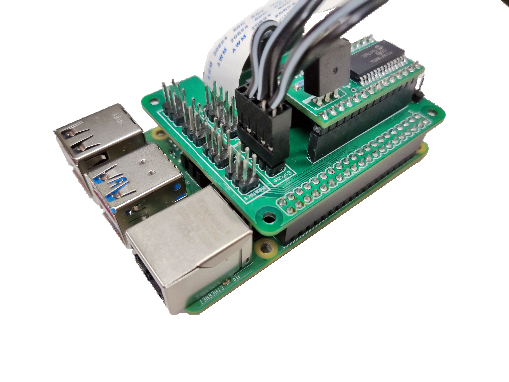

# Complete the wiring

These instructions assume you are using a Raspberry Pi v4, a Pi Hat, and the Strobe module.

{{BOM}}

[M3x25mm cap head screw]: parts/mech/M3-25.md "{cat:mechanic}"
[M3 nut]: parts/mech/nuts.md "{cat:mechanic}"
[Raspberry Pi]: parts/elect/rpi-v4.md "{cat:electronic}"
[Pi Hat]: parts/elect/pi-hat.md "{cat:electronic, note:'This is a custom open-source board documented [here](https://github.com/wenzel-lab/open-microfluidics-workstation/)'}"
[Strobe Module]: parts/elect/strobe-module.md "{cat:electronic, note:'This is a custom open-source board documented [here](https://github.com/wenzel-lab/open-microfluidics-workstation/)'}"
[Strobe Cable]: parts/elect/strobe-cable.md "{cat:electronic, note:'This is a custom connector documented [here](https://github.com/wenzel-lab/open-microfluidics-workstation/)'}"
[Needle-nose plier]: parts/tools/pliers.md "{cat:tool}"
[2.5mm Ball-end Allen key]: parts/tools/2.5mmBallEndAllenKey.md "{cat:tool}"
[Spacer-S]: models/spacer-4mm.stl "{previewpage}"
[Spacer-M]: models/spacer-11mm.stl "{previewpage}"
[Nitrile gloves]: parts/consumables/gloves.md "{cat:consumable}"
[Tweezers]: parts/tools/tweezers.md "{cat:tool}"
[other solutions]: https://github.com/DropletKitchen/strobe "Light Strobing to Improve Images from Cameras"

>! **Caution** 
>!
>! Use [tweezers][Tweezers]{Qty:1} and [gloves][Nitrile gloves]{Qty:1} to avoid directly touching the electronic components. This can avoid accidental damages.

## Connect the camera {pagestep}

* Insert the ribbon cable from the optics module into the camera port of the [Raspberry Pi]{qty:1}, ensuring the contacts are on the opposite side of the clasp. There are [detailed instructions on the Raspberry Pi website](https://projects.raspberrypi.org/en/projects/getting-started-with-picamera/2).

## Prepare the electronics {pagestep}

* Place the [strobe module][Strobe Module]{qty:1} over the [Pi hat][Pi Hat]{qty:1}.
* Mount the Pi hat on the Raspberry Pi GPIO headers. There is a space to place the ribbon cable.

* Connect the 5-pin double row DuPont female connector of the [strobe cable][Strobe Cable]{qty:1} to the Pi hat.

