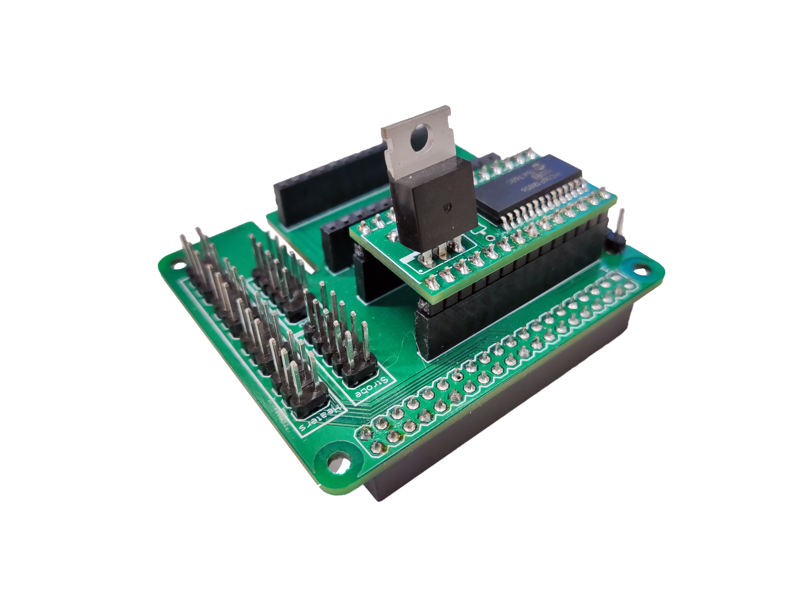
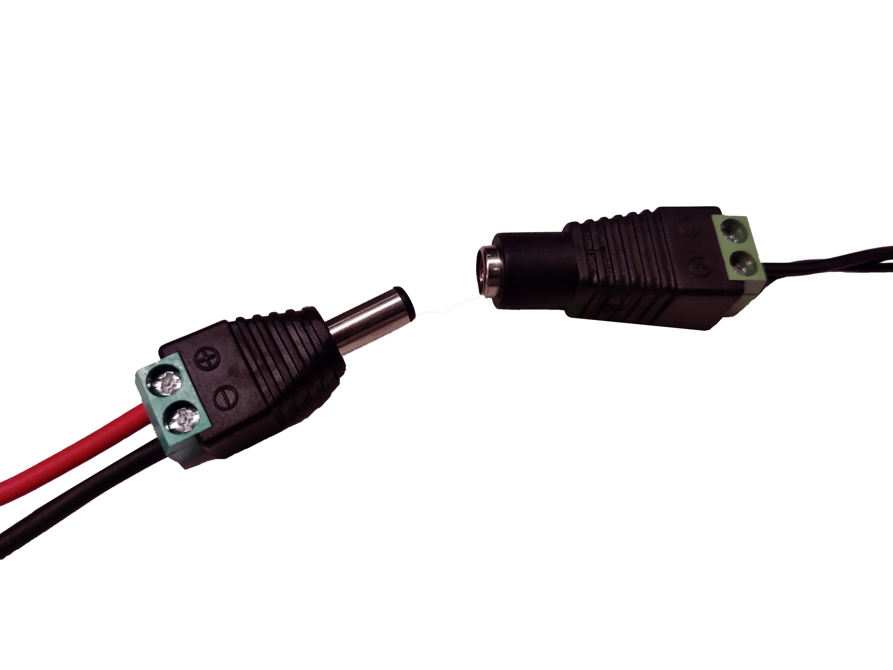

# Complete the wiring

These instructions assume you are using a Raspberry Pi v4, a Pi Hat, and the Strobe module.

{{BOM}}

[Raspberry Pi]: parts/elect/rpi-v4.md "{cat:electronic}"
[Raspberry Pi Power Supply]: parts/elect/rpi-power-supply.md "{cat:electronic}"
[Pi Hat]: parts/elect/pi-hat.md "{cat:electronic}"
[Strobe Module]: parts/elect/strobe-module.md "{cat:electronic}"
[Strobe Cable]: parts/elect/strobe-cable.md "{cat:electronic}"
[Strobe Power Supply]: parts/elect/strobe-power-supply.md "{cat:electronic}"
[Voltage regulator]: parts/elect/voltage-regulator.md "{cat:electronic}"

>i **Alternative electronics options**
>i
>i Currently, there is no alternative electronics tested yet, but you can find [other solutions] based on different boards, such as Teensy board, for controlling a strobe.

[other solutions]: https://github.com/DropletKitchen/strobe "Light Strobing to Improve Images from Cameras"

## Connect the camera {pagestep}

* Insert the ribbon cable from the optics module into the camera port of the [Raspberry Pi]{qty:1}, ensuring the contacts are on the opposite side from the clasp. There are [detailed instructions on the Rasbperry Pi website](https://projects.raspberrypi.org/en/projects/getting-started-with-picamera/2).

## Mount the Pi hat and strobe module {pagestep}

* Place the [strobe module][Strobe Module]{qty:1} over the [Pi hat][Pi Hat]{qty:1}.
* Mount the Pi hat on the Raspberry Pi GPIO headers. There is a space to place the ribbon cable.

## Connect the strobe {pagestep}

* Connect the 5-pin double row DuPont female connector of the [strobe cable][Strobe Cable]{qty:1} to the Pi hat. 
* Connect DuPont female 2-pin connector of the strobe cable to the 2-pin male connector of the illumination wiring. Be careful to connect positive and negative terminals in wrong position.

## Power up the station {pagestep}

* Verify the [voltage regulator][Voltage regulator]{qty:1} is configured to supply 3V. Higher voltage can damage your strobe. 
* Connect the 5.5x2.1mm connector of the strobe cable to the voltage regulator. 
* To power up your station you will need two 5V/3A power supplies: one with a [USB-C connector][Raspberry Pi Power Supply]{qty:1} for the Raspberry Pi and one with a [male 5.5x2.1mm jack connector][Strobe Power Supply]{qty:1} for the strobe illumination.

